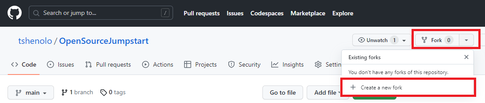
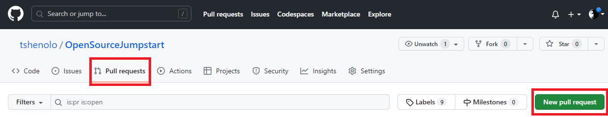

# Open Source Jumpstart
Welcome to OpenSourceJumpstart, a beginner-friendly repository designed to help aspiring developers get started with contributing to open source projects. 
Whether you're new to programming or looking to expand your skills, this repository aims to guide you through the process of becoming an open source contributor.

Open Source Contribution consists of identifying a project you would like to contribute to and following the steps below. I have created this project/repository to allow you to get hands on experience. 

## Thank you for the Support
- ⭐ Give this repo a ⭐ star ⭐ at the top of the page
- 🐦 Follow me on twitter [twitter](https://twitter.com/tshenolo)
- 📺 Subscribe to my [Youtube channel](https://www.youtube.com/@tshenolo?sub_confirmation=1)

## Options for Contributing to Open Source
When it comes to contributing to open source projects, you have several options for interacting with Git and GitHub. Choose the one that suits your preferences and experience level:

1. [Git Command Line](guides/git.md): The Git command line interface provides full control and flexibility for managing your local repositories and interacting with remote repositories. It requires familiarity with basic Git commands, such as git clone, git add, git commit, and git push. This option is suitable for developers comfortable working with the command line.

2. [GitHub CLI](guides/cli.md): GitHub CLI is a command-line tool specifically designed for GitHub. It provides an intuitive way to interact with GitHub repositories and perform various tasks, such as creating pull requests, reviewing code, and managing issues. GitHub CLI simplifies the workflow by eliminating the need to switch between the command line and the GitHub web interface.

3. [GitHub Desktop Application](guides/desktop.md): GitHub Desktop is a user-friendly application that provides a graphical interface for managing your Git repositories. It offers an intuitive way to clone repositories, make changes, commit code, and synchronize with remote repositories. GitHub Desktop is an excellent option for those who prefer a visual approach to working with Git and GitHub.

4. [GitHub.com Web Interface](guides/web.md): The GitHub.com web interface is accessible through any web browser and provides a comprehensive set of features for contributing to open source projects. You can create new branches, make changes to files, commit code, submit pull requests, and participate in discussions, all through the GitHub.com interface. This option requires no additional software installation and is suitable for beginners or those who prefer a web-based workflow.

Choose the option that aligns with your preferred workflow and comfort level with Git and GitHub. Regardless of the method you choose, the key is to understand the underlying concepts and processes involved in contributing to open source projects.

If you do not have git installed on your machine, we recommend installing it. You can find detailed instructions on setting up git in the documentation available at [https://docs.github.com/en/get-started/quickstart/set-up-git](https://docs.github.com/en/get-started/quickstart/set-up-git)


## 🎬 Video demonstration

[](https://www.youtube.com/watch?v=NpEaa2P7qZI)

<iframe width="560" height="315" src="https://www.youtube.com/embed/NpEaa2P7qZI" title="YouTube video player" frameborder="0" allow="accelerometer; autoplay; clipboard-write; encrypted-media; gyroscope; picture-in-picture; web-share" allowfullscreen></iframe>

## 🚀 Start Contributing
[Step 1: Fork this repository](#fork-this-repository)  
[Step 2: Clone this repository](#clone-this-repository)  
[Step 3: Create a branch](#create-a-branch)  
[Step 4: Make your changes](#make-your-changes)  
[Step 5: Stage your changes](#stage-your-changes)  
[Step 6: Commit your changes](#commit-your-changes)  
[Step 7: Push your changes to GitHub](#push-your-changes-to-github)  
[Step 8: Submit a pull request](#submit-a-pull-request)    


## Fork this repository
Forking the repository means creating your own copy of the project on GitHub. By forking, you will have your independent version of the project that you can freely modify and experiment with. Forking is the first step to contributing to an open source project.

👉🏻 Click on the "Fork" button on the GitHub repository page 
then click Create a new Fork.



## Clone this repository
Cloning the repository involves creating a local copy of the project on your computer. You can use Git commands or a Git client to clone the repository. Cloning enables you to work on the project's code and make changes locally.

👉🏻 Open your Command line and execute the following command:

```
git clone https://github.com/your-username/OpenSourceJumpstart.git
```
Note: replace your-username in the command above with your username. eg tshenolo

## Create a branch
Before making any changes to the code, create a new branch. Branches provide a way to isolate your changes from the main codebase, allowing you to work on a specific feature or bug fix independently. Create a descriptive branch name that reflects the purpose of your changes.

👉🏻 Navigate into your local repository using the following command:
```
cd OpenSourceJumpstart
```

👉🏻 Create a branch by executing the following command:
```
git checkout -b your-username-contribution
```
Note: replace your-username in the command above with your username. eg tshenolo

## Make your changes
Once you have created a branch, start making your desired changes to the codebase. This can include fixing bugs, adding new features, improving documentation, or optimizing existing code. Follow the project's guidelines and coding conventions to ensure consistency with the existing codebase.

👉🏻 Open CONTRIBUTORS.md in your code editor then add the following:
```
- [Your Name](https://github.com/your-username)
```
Note: Replace "Your Name" with your name and your-username with your github username. For example.
```
- [Tshenolo Mos](https://github.com/tshenolo)
```

## Stage your changes
After making your desired changes to the code, the next step in the contribution process is to stage your modifications. Staging involves selecting the specific files or changes that you want to include in your commit. By staging changes, you are indicating to Git that you want these modifications to be part of your next commit.

For example, to stage a single file named "example.py", you would run the following command:

```
git add example.py
```

To stage all changes in the current directory and its subdirectories, you can use a wildcard:

```
git add .
```

👉🏻 Stage your changes by executing the following command:
```
git add CONTRIBUTORS.md
```


## Commit your changes
Committing is the process of saving your changes locally with a descriptive message. Make atomic commits, which means each commit should contain a single logical change. Clearly describe the purpose and scope of your changes in the commit message to aid understanding for other contributors and maintainers.

👉🏻 Commit your changes by executing the following command:
```
git commit -m "Your-Name Contribution"
```
Note: Replace "Your-Name" with your name

## Push your changes to GitHub
After committing your changes locally, push your branch to your forked repository on GitHub. This action syncs your local changes with your remote repository on GitHub, making it accessible to others. Other developers can now see your changes and review them.

👉🏻 Push your changes to Github by executing the following command: 

```
git push -u origin your-username-contribution
```
Note: replace your-username in the command above with your username. eg tshenolo.
your-username-contribution is the branch you created in the Create a branch step. 

## Submit a pull request
A pull request (PR) is the formal way of proposing your changes to the original repository for review and potential inclusion. It allows you to compare and merge your branch into the main project. Submitting a PR initiates a discussion with the project maintainers and other contributors, who can provide feedback, suggestions, or request changes before merging your code.

👉🏻 After pushing your branch to your forked repository, go to the original repository's GitHub page and click on "New pull request".



## Next Steps
After submitting a pull request, the project maintainers will review your changes. Be responsive to their feedback and address any requested changes or improvements. Engage in discussions around your contribution, answering questions and addressing concerns. Once your changes meet the project's standards and requirements, they will be merged into the main codebase. 

🎉 Congratulations on successfully contributing to the project!

Next steps may include exploring other issues or features to work on, continuing to improve the project, or exploring other open source projects to contribute to. You can also encourage others to get involved in open source and share your experiences to inspire more developers to contribute.

By following these steps, developers can gain practical experience in contributing to open source projects, familiarize themselves with collaboration workflows, and build their reputation in the open source community.

## Become a maintainer of this repo
Are you interested in becoming a maintainer for this project and contributing to its development? If so, please read the [maintainer's guide](MAINTAINER_GUIDE.md) and send me a direct message on [Twitter](https://twitter.com/tshenolo) to express your interest. 

## Code of Conduct
We strive to maintain an inclusive and welcoming community. Please review and abide by our [Code of Conduct](CODE_OF_CONDUCT.md).

## Issue Tracker
If you encounter any bugs, have feature suggestions, or want to discuss project-related topics, please use our 
[issue tracker](https://github.com/tshenolo/OpenSourceJumpstart/issues) to communicate with the community.

## Frequently Asked Questions (FAQ)
Check out our [FAQ](FAQ.md) for answers to common questions and concerns.

## Resources
For additional resources on open source contribution and programming, refer to our curated list of [resources](RESOURCES.md).

## Contact Information
For any further questions or inquiries, feel free to reach out to us at contact@tshenolo.me or connect with us on [Twitter](https://twitter.com/tshenolo).

We look forward to your valuable contributions and hope this repository serves as a launching pad for your open source journey!


